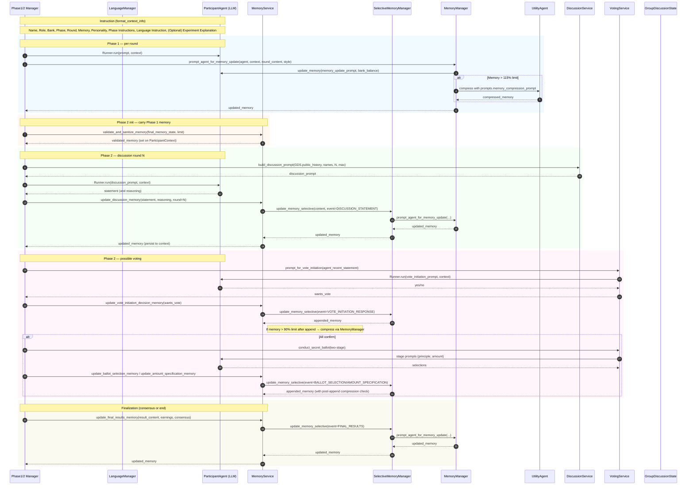

How# Experiment Flow Diagrams

Below are sequence and component-level diagrams illustrating the end-to-end experiment flow, the agent calls, and the content elements passed on each call.



```mermaid
flowchart LR
    subgraph Phase1
      P1M[Phase1Manager]
      MM[MemoryManager]
      UA[UtilityAgent]
      PA[ParticipantAgent]
      LM[LanguageManager]
      P1M -->|Runner.run + Instructions| PA
      P1M -->|round_content| MM
      MM -->|memory_update_prompt (prompts.memory_*)| PA
      MM -->|compress if needed| UA
      LM -. provides .-> MM
      LM -. provides .-> P1M
    end

    subgraph Phase2
      P2M[Phase2Manager]
      MS[MemoryService]
      SMM[SelectiveMemoryManager]
      DS[DiscussionService]
      VS[VotingService]
      GDS[GroupDiscussionState]
      P2M -->|init| MS
      MS -->|validate carryover| P2M
      P2M --> DS -->|discussion_prompt| P2M -->|Runner.run + Instructions| PA
      P2M -->|statement,reasoning| MS --> SMM --> MM --> PA
      VS -->|prompts| PA --> VS
      P2M -->|vote mem updates| MS --> SMM
      MS -->|post-append check| MM
    end

    PA --- LM
```

Notes
- Instructions always include: Name, Role, Bank Balance, Phase, Round, Memory (full display), Personality, Phase Instructions, Language Instruction, optional Experiment Explanation.
- Memory updates: complex events → full LLM update via MemoryManager; simple events → append, then post-append compression if near limit.
- Discussion history is embedded in discussion prompts (not in the global instruction block) via `DiscussionService.build_discussion_prompt`.
