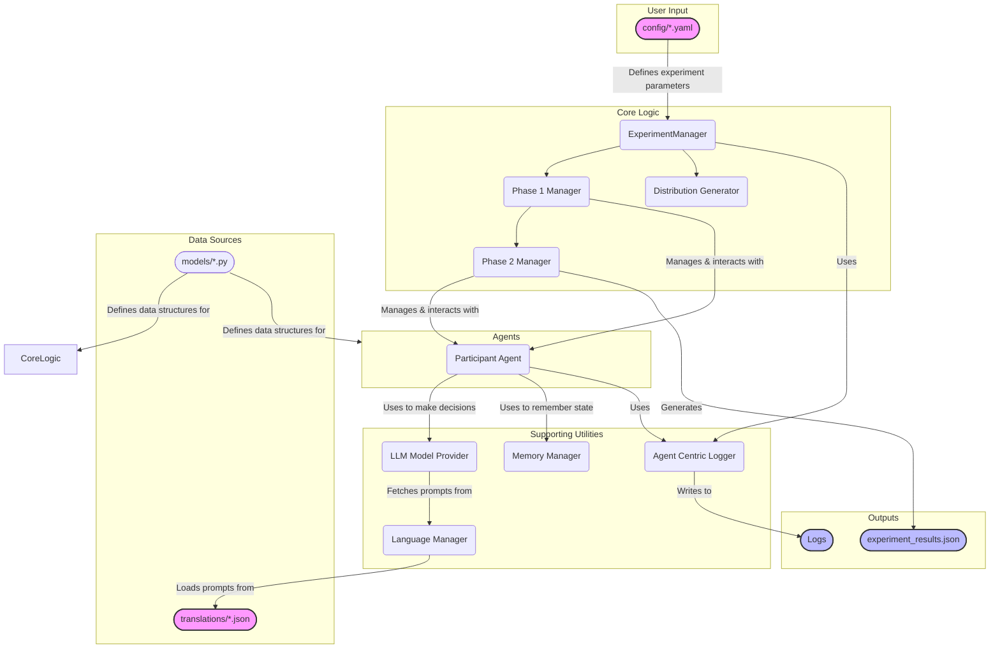

# Rawls Framework - Architectural Overview

This document provides a high-level architectural diagram of the Rawls project. The intended audience is technical management, offering a clear view of the system's key components, their interactions, and the primary data and control flows.

## System Architecture

The diagram below illustrates the component-based architecture of the Rawls framework. It is designed to be modular and extensible, with a clear separation of concerns between the core orchestration logic, agent implementations, and supporting utilities.

### Component Descriptions

*   **User Input (`config.yaml`)**: Defines all parameters for an experiment, such as the number of agents, principles, and resource distributions. This is the primary entry point for configuring a new experiment.
*   **Core Logic**:
    *   **`ExperimentManager`**: The central orchestrator. It initializes the system based on the configuration and manages the overall flow of the experiment through its phases.
    *   **`Phase 1 & 2 Managers`**: Each manager is responsible for a distinct phase of the experiment, handling the interactions with agents specific to that phase (e.g., deliberation vs. resource allocation).
    *   **`Distribution Generator`**: A utility used by the `ExperimentManager` to create the initial resource distribution for the agents.
*   **Agents (`ParticipantAgent`)**: Represents an individual participant in the simulation. This component encapsulates the decision-making logic, which is powered by an external LLM via the `ModelProvider`.
*   **Supporting Utilities**:
    *   **`LLM Model Provider`**: A crucial service that acts as a client to external Language Model APIs (e.g., OpenAI, Gemini). It abstracts away the complexity of API calls.
    *   **`Language Manager`**: Manages multilingual prompts, loading the appropriate text from the `translations` directory.
    *   **`Agent Centric Logger`**: A specialized logger for recording events and decisions with a focus on which agent performed the action.
    *   **`Memory Manager`**: Provides a stateful memory system for agents, allowing them to recall past events or decisions.
*   **Data Sources**:
    *   **`translations/*.json`**: Stores the prompt templates in different languages.
    *   **`models/*.py`**: Contains the Pydantic data models that define the strict data structures used for configuration, agent responses, and internal state.
*   **Outputs**:
    *   **`experiment_results.json`**: The final structured output of an experiment run, containing all key decisions and outcomes.
    *   **`Logs`**: Detailed logs generated by the `Logger` for debugging and analysis.

### Control & Data Flow

1.  The `main.py` script reads a `config.yaml` file to initialize the `ExperimentManager`.
2.  The `ExperimentManager` orchestrates the experiment, proceeding sequentially through `Phase1Manager` and `Phase2Manager`.
3.  The Phase Managers interact with multiple instances of the `ParticipantAgent`.
4.  When an agent needs to make a decision, it uses the `ModelProvider` to query an LLM. The prompts for the LLM are supplied by the `LanguageManager`.
5.  Throughout the process, all components use the `Logger` to record their activities.
6.  Once the experiment is complete, the `Phase2Manager` compiles and writes the final `results.json` file.
